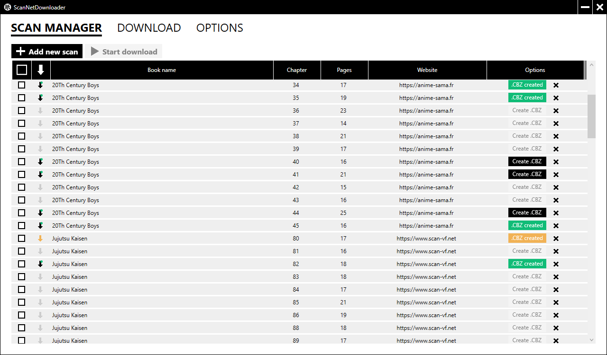
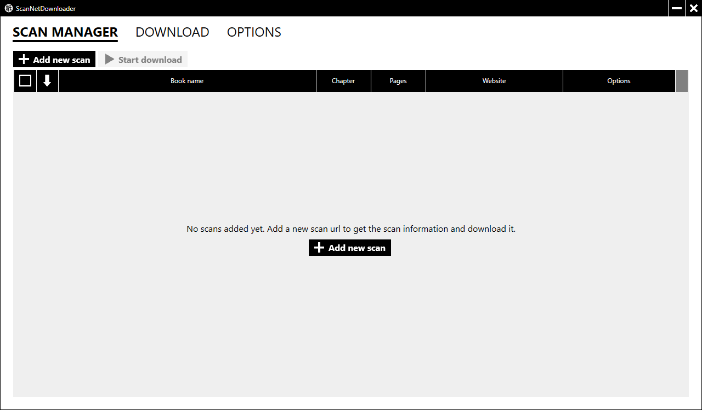
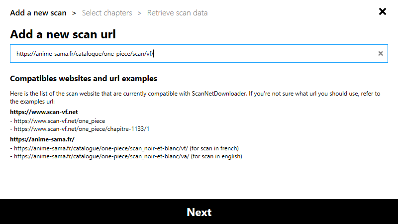
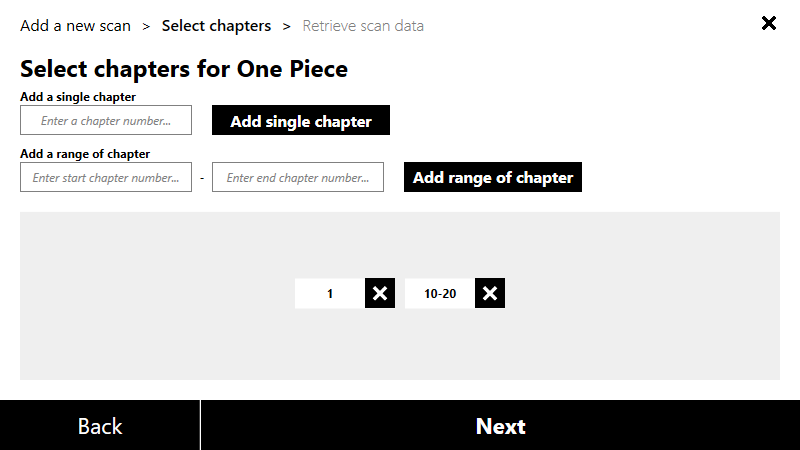
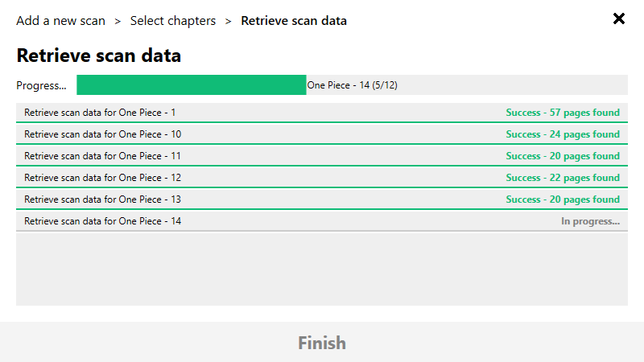
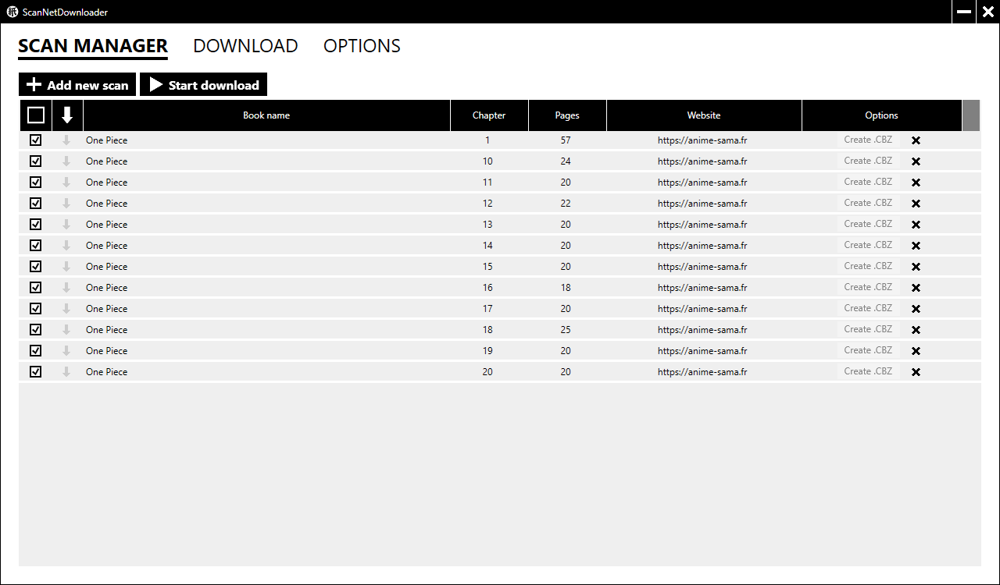
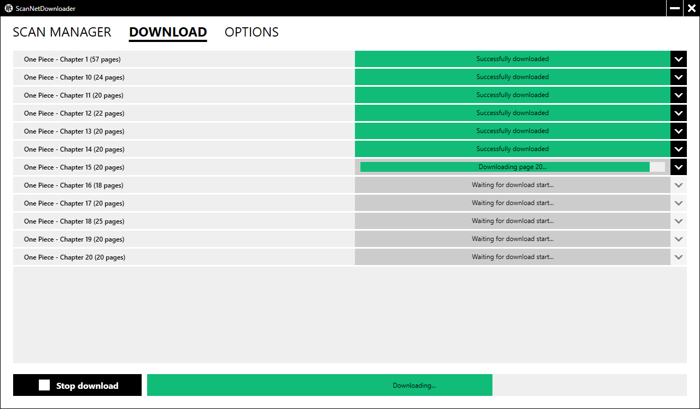

Summary:
- [What is ScanNet Downloader ?](#what-is-scannet-downloader-)
- [What are the compatible scan websites ?](#what-are-the-compatible-scan-websites-)
- [How to use ScanNet Downloader ?](#how-to-use-scannet-downloader-)
    - [Add a new scan](#add-a-new-scan)
    - [Download scans](#download-scans)
    - [Import previous data after updating to a new version](#import-previous-data-after-updating-to-a-new-version)

# What is ScanNet Downloader ?

ScanNet Downloader is a simple app to automate the downloading of scans and the creation of a .cbz archive.
You provide a scan url to download and the software will do the rest.

# What are the compatible scan websites ?

Currently, the compatible website are:

- www.scan-vf.net
- www.anime-sama.fr
- www.lelscans.net

> If the scan website you use is not part of this list, contact me or open an issue and I'll do my best to make ScanNet Downloader compatible with it.
> Some scan websites are well protected to prevent the user to download the scan image so some websites may never be compatible.

# How to use ScanNet Downloader ?

## Add a new scan

 

To add a new scan click on the "add new scan" button. A new window will open with a 3 steps process: entering the scan url, selecting the chapters, retrieving the scan data for the url and the chapters you specified.

### Enter the scan url

 

Just enter the url of the scan in the text field and click "Next". If the url is invalid you will have an alert and you'll need to provide a valid url.

>If you encounter a case where you think the url is valid but an alert is triggered please open an issue and specify the url in it. That will help me to take into account possibilities I has not expected.

#### Compatibles url

In most of the case if you copy-paste the link of the first page of the scan you want to download it should work but depending on the website you may have more options.

##### Scan-vf.net

>You can either provide directly the url of a chapter or the url of the book. 
>Here is an example for both possibilities:
>
>- Url of a chapter: https://www.scan-vf.net/one_piece/chapitre-1/1.
>- Url of a book: https://www.scan-vf.net/one_piece.

##### Anime-sama.fr

>Open any chapter of the scan and copy-paste the url. 
>The url should look like this: https://anime-sama.fr/catalogue/one-piece/scan/vf/.

##### Lelscans.net

>Open any chapter at any page of the scan and copy-paste the url, even the url of the home page of a book is working 
>
> - Url of a chapter: https://lelscans.net/scan-one-piece/1142
> - Url of a chapter with page number: https://lelscans.net/scan-one-piece/1142/5
> - Url of a book home page: https://lelscans.net/lecture-ligne-one-piece

### Select the chapters

 

Add chapters one by one or directly enter a range of chapters. You can also mix both possibilities. If the url you entered was specifying a chapter the chapter should be added automatically to the chapter selection.

### Retrieve scan data

 

In this step the app will automatically look online to collect the data necessary to download the scan for each chapters. **The scans are not downloaded during this steps we only get the necessary data to successfully download the scans later**.
Wait for the completion of the scan data retrieval, once it's done you will be able to click the finish button and the scan data will be added in the scan manager view. 

## Download scans

 

### Select some scans to download

To download a scan you must first select them for download in the scan manager view. To select a scan just click on the checkbox to tick it. When you add a new scan, it is automatically selected for download by default.

### Download the scans

You can either directly click the "Start download" button in the scan manager view or open the download view and review the scans selected before starting the download from there. When you click to start the download a window will tell you where the scan will be download and ask you to confirm the start of the download. *If you want to change the download folder, cancel the download and change the download location in the options.*  
After a scan is downloaded, a .cbz archive is automatically created unless you disabled it in the option. Once the download is complete, by default, an explorer window is opened at the location of the downloaded files.

## Import previous data after updating to a new version

> :warning: When we speak about data here we only speak about the scan informations and app settings. We are not talking about downloaded images, they stay where you downloaded them.

I did a pretty bad decision when choosing where to save the data and settings, this means that when downloading a new version of the app you lose the data from the previous version. I intend to improve that in the next version but in the meantime here is how to import your previous data after downloading a new version.

### Where are saved the data and settings ?

Currently, both the data and settings are saved next to the app .exe in ***ScansLocalData.json*** and ***Settings.json***.

### Import previous data

To import previous data you just need to copy the ***ScansLocalData.json*** and ***Settings.json*** files from the previous version of the app and paste them next to the .exe of the app new version. By doing so, you replace the empty files of the new version by your previous data and settings.

